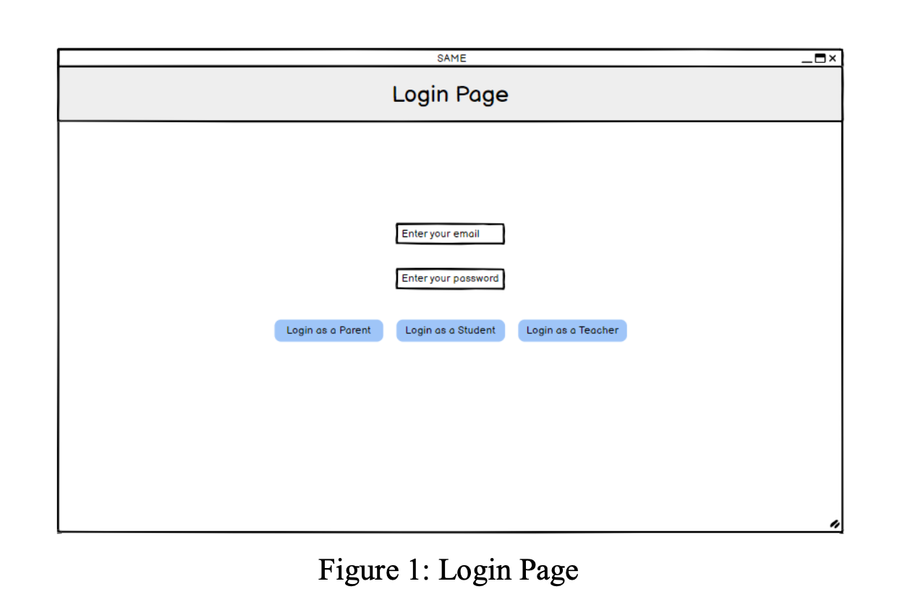
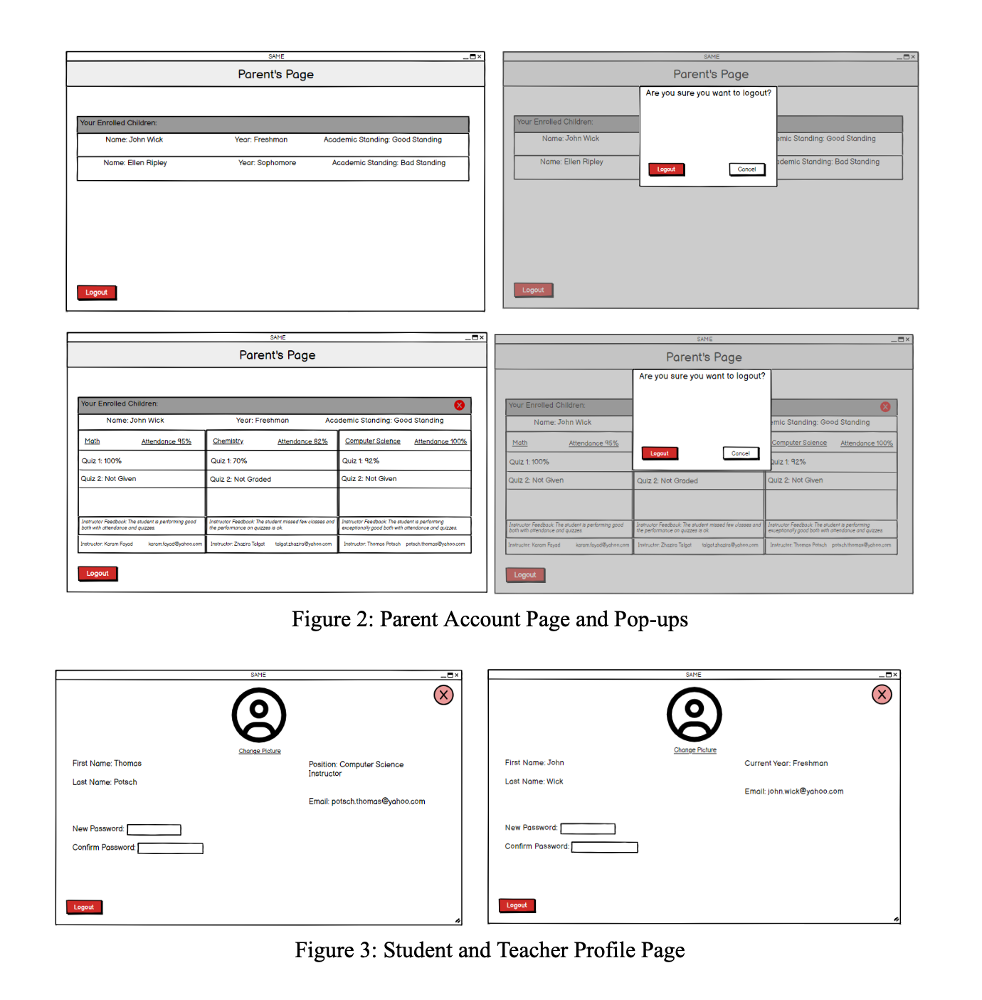
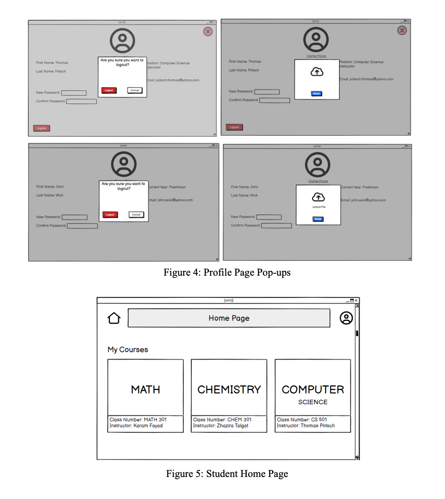
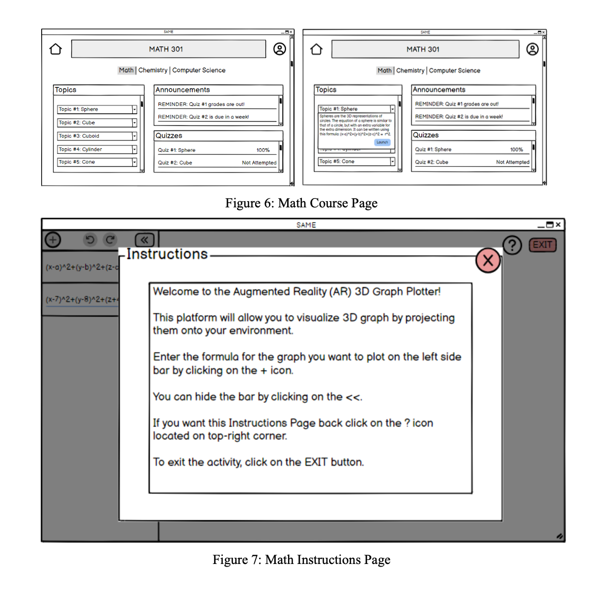
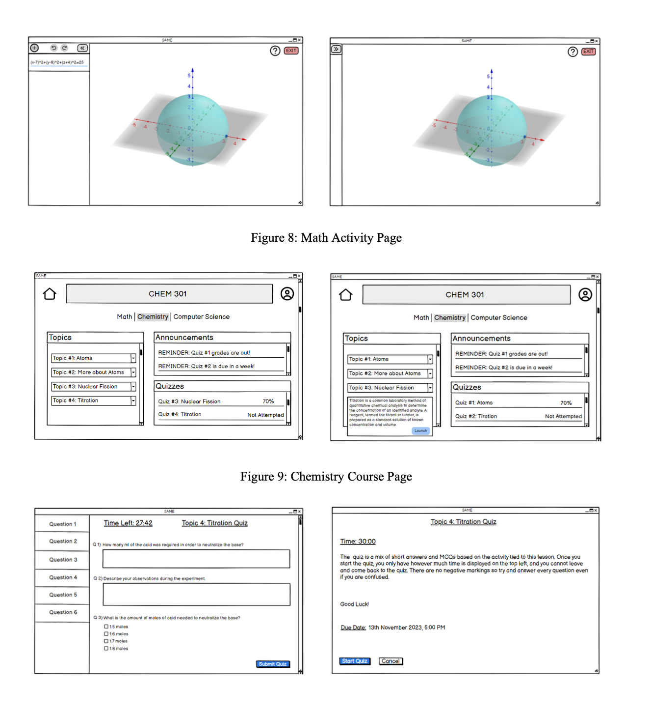
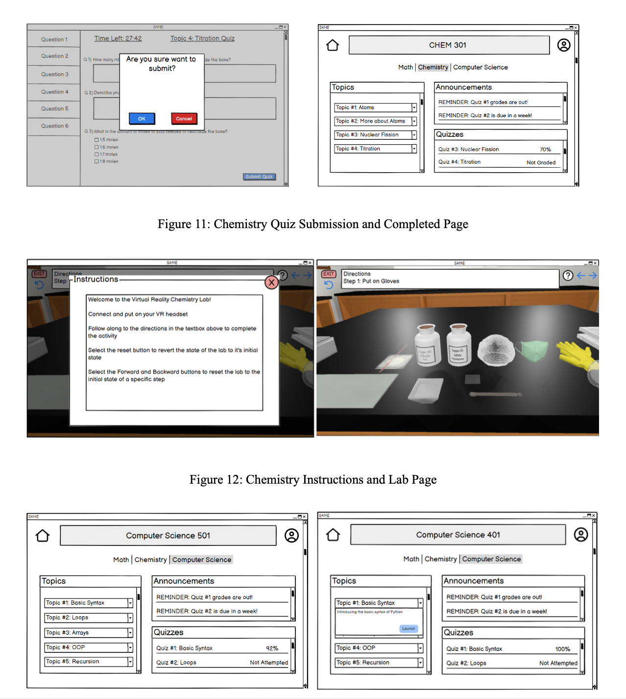
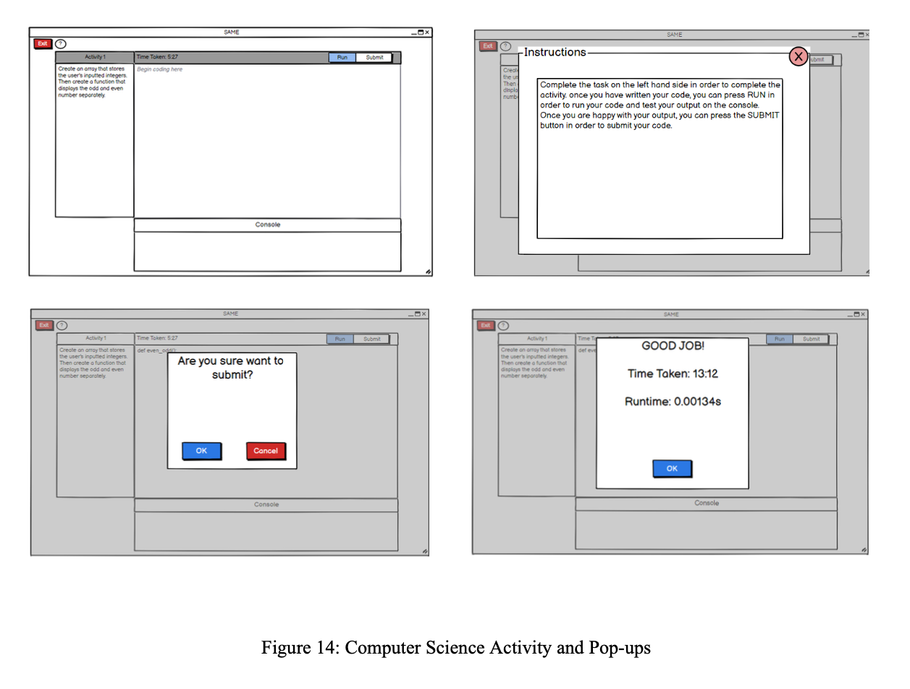
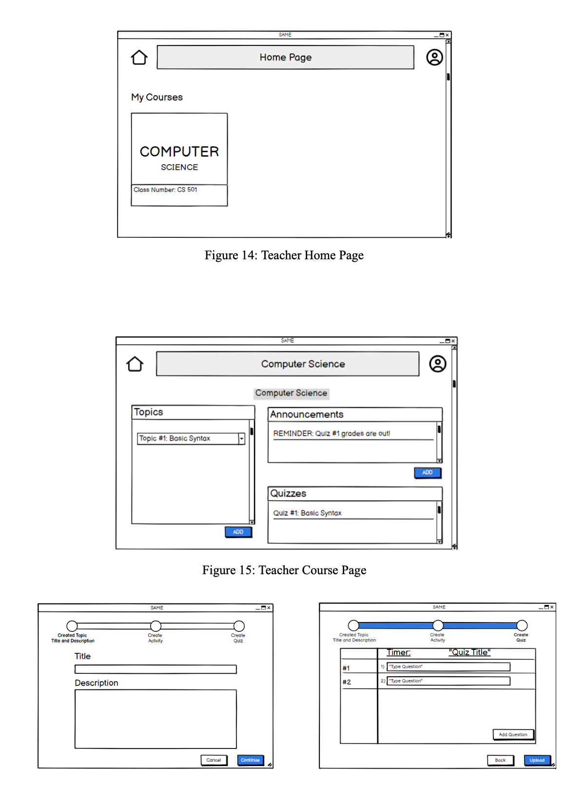
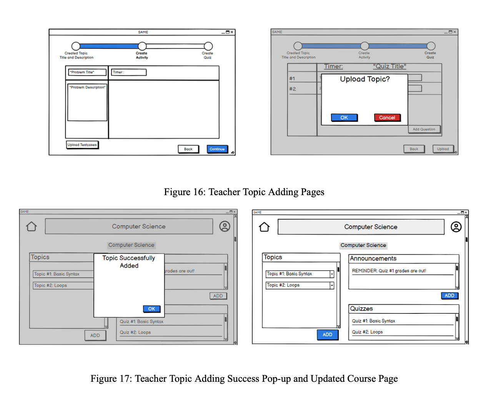

# SAME-Complementary-eLearning-platform

**SDG Goal:** Quality Education (Goal #4)
**Product:** A supplementary online learning platform designed for high school students that leverages VR/AR/Interactive technologies

Our vision is to create an innovative online learning platform that harnesses the power of Virtual and Augmented Reality (VR/AR) combined with Artificial Intelligence (AI) to revolutionize education. Our platform is designed to provide school students with immersive and playful learning experiences, allowing them to gain hands-on experience and a deeper understanding of various subjects. Whether it's conducting biology lab experiments, delving into coding challenges, or exploring other topics, our platform offers a diverse range of features, programs, and activities tailored to each subject's unique requirements.
For instance, in our coding program, students engage in head-to-head coding competitions where they create programs based on prompts provided by the platform. The AI algorithms analyze factors such as the time taken, code optimization, and overall performance, providing valuable feedback to help students identify their strengths and weaknesses. Our mission is to make high- quality education accessible to students worldwide. By eliminating the need for physical labs for subjects like physics and biology, our platform empowers learners to access these educational resources from anywhere, breaking down geographical and logistical barriers. We aspire to create a dynamic and inclusive learning environment that empowers students to thrive in an ever- evolving educational landscape.

**Primary Personas:**
- Elementary, middle, and high school students
- Teachers (teachers, teaching assistants, etc.)
- Parents

**Design:**
The 3 main personas that we identified for our product were high school students, teachers (teachers, teaching assistants, etc.), and parents. We also wanted to give parents the ability to check on their own children’s progress so they can be more involved in their educational journey. Thus, we created 3 separate interfaces for each personas having access to different features. For example, teachers obviously have administrative powers in managing their courses such as adding new topics, quizzes, and adding activities for the student to take part in. Parents get to view the progress of their multiple children (if they have multiple) in the different subjects such as grades, attendance, and whether they are meeting their deadlines. They will also be provided with the contact information of the instructors in case they want to get in touch about their child’s progress. Students, as one of our main focuses, have access to multiple features in order to enhance their learning experience. Being able to access different kinds of activities tailored towards different topics such as labs for science classes, 3D graph manager for Maths class, and a time-based coding activity for Computer Science class. These additional activities supplemented on top of their usual daily studies make sure that they are grasping a better understanding of the concept by making them take a more hands-on approach to these topics and to think more creatively instead of the usual textbook revision. The layout of our web application was inspired by Brightspace and so we took what we felt are the most important aspects and put them in the front of our homepage which are announcements, quizzes, and the topics. This means seamless access for students when they want to do an activity or quiz. The teacher’s homepage had a similar layout to the student’s homepage with the added function of being able to add topics and quizzes. We focused on making sure that the teacher was well-informed about their progress during adding a topic and quiz by providing a progress bar at the top and providing a mock graphical layout so they can easily visualize the topic they are creating. For the parents page, we utilized drop down boxes in order to make the page not feel too cluttered and the parent can selectively view the information without unnecessary information cluttering their view. For the tasks, we aimed for the student personas to complete the activities for all 3 subjects in order to showcase how we plan to implement VR and AR into the platform and how effective the user thinks it would be. The teacher persona focused on adding an activity and quiz in order to test the UI and to make sure the teacher would feel informed throughout the process and whether they understood the progression of adding a course correctly. The parent persona simply focused on accessing their page and to view the grades of their child to test whether all the information a parent would want to see for their child is present in a neat and presentable way.

**Medium Fidelity Prototype:**

The Medium Fidelity Prorotype of our product was created on Balsamiq.
Link to the Video of Screengrab: https://drive.google.com/file/d/15KDAxaqk4pgrPl44PGpDVf9e3SpC3wDO/view?usp=sharing

***

